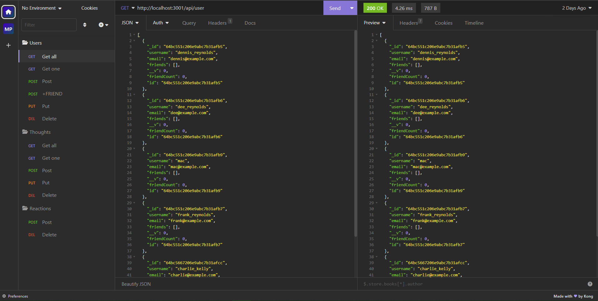

# Social-Media-Api

## Description

This application uses Express and MongoDB to build an API for a social media network web application that allows users to share thoughts, react to thoughts, and create a friend list. The project was built for Denver University's Coding Boot Camp as part of a challenge assignment.

## Installation

To use this application, please ensure the following tools are installed on your PC:

A source-code editor, such as [Visual Studio Code](https://code.visualstudio.com), a version control system, such as [Git](https://git-scm.com), and [Node.js](https://nodejs.org/en). As this database uses MongoDB, consider installing [MongoDB Compass](https://www.mongodb.com/products/compass) also. An API development platform, such as [Insomnia](https://insomnia.rest), may also make interacting with this project easier.

Installation guides for these tools are provided in each link. You may now proceed with copying or [cloning](https://docs.github.com/en/repositories/creating-and-managing-repositories/cloning-a-repository) this repository to your machine.

## Usage

Provided the project files have been copied to your machine, navigate to the project's root Social-Media-Api folder, then to its _Develop_ folder. Using Git, or a compatible source-code editor, open your terminal and type the commands:

`npm i`

`npm start`

Now open MongoDB Compass or Insomnia to modify the social media API's database. Use the following walkthrough video as an example of how to use the application.

[(Full video)](https://vimeo.com/848152377)

## Credits

https://www.mongodb.com

https://nodejs.org/en

https://expressjs.com

https://insomnia.rest

https://code.visualstudio.com

## Tests

Testing is currently unavailable for this application.

## Contributing

Contributing is not permitted for this application.

## License

This project is licensed under the [MIT License](https://en.wikipedia.org/wiki/MIT_License)
